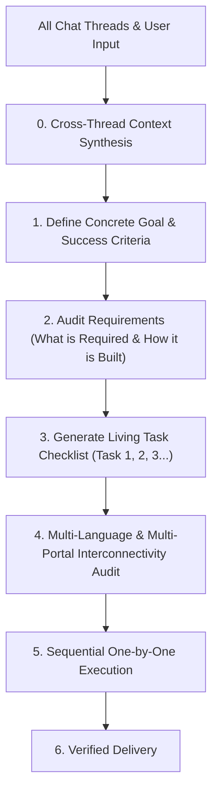

# 🛡️ Zero-Guess Debugger (`zero-guess-debugger`)

[](https://opensource.org/licenses/MIT)
[](https://github.com/parinkukadia55/zero-guess-debugger)
[](http://makeapullrequest.com)
[](#-quick-installation)

> **Stop AI coding assistants from burning your quota with blind trial-and-error.**  
> An autonomous execution and debugging framework for AI agents. Combines **Cross-Thread Context Synthesis**, **Goal Decomposition & Living Task Checklists**, **Multi-Language (i18n) Parity**, **Multi-Portal Interconnectivity (Web + User Home + Admin Panel + Mobile Shell)**, **Native AI Generative Media Mandates**, with strict **Zero-Hallucination**, **Pre-Fix Proof Cards**, **2-Attempt Circuit Breakers**, and **Bidirectional Reverse-Checking**.

---

## 💥 The Pain: Why AI Agents Break Complex Systems

Most AI coding assistants struggle in real-world production codebases:
1. **Trial-and-Error Guessing:** They edit files blindly without reading source code, running in circles and burning 100,000+ tokens.
2. **Context Amnesia:** They forget requirements discussed 3 turns ago in the chat thread.
3. **Python Script Fallback for Images:** When asked to generate an image or video, they lazily write crude Python PIL/matplotlib scripts to draw geometric squares instead of calling actual generative AI image models!
4. **Broken Multi-Language (i18n):** They hardcode raw English strings into buttons and leave Hindi/Gujarati/Spanish translation files desynchronized or broken.
5. **Half-Baked Updates (Broken Multi-Portal Wiring):**
   * They update an **Admin Panel** toggle, but it **never connects or reflects in the User/Home Panel**.
   * They add a button but **break Dark Mode** (white text on white background).
   * They change a view on the Web but break the **Mobile (Capacitor/React Native)** shell.
   * They add a route but **forget to register navigation links** or auth guards.

**Zero-Guess Debugger** permanently eliminates these failure modes by enforcing end-to-end discipline across every portal, theme, language, and asset pipeline.

---

## 🧵 Phase 0: Cross-Thread Context Synthesis (Unified Chat Rule)

Before planning or executing, the agent combines the entire conversation history:
* Synthesizes all previously agreed constraints, design preferences, and architectural decisions.
* Ensures that historical requirements (e.g. mobile responsiveness, multi-language parity, theme compatibility) are never forgotten or dropped in subsequent turns.

---

## 🧭 Phase 1: Goal Planning & Task Decomposition



1. **Goal Formulation:** Restate the objective in unambiguous technical terms.
2. **What is Required:** Explicitly map files to create/modify, packages, schemas, API contracts, translation dictionaries, and visual assets.
3. **How It Will Be Created:** Concrete architectural strategy, data flow, function hierarchy, and multi-portal sync plan.
4. **The Living Task Checklist:** Discrete, atomic milestones tracked sequentially.

---

## ⚡ Phase 2: Sequential Step-by-Step Execution & Live Tracking

The agent executes the plan **one task at a time**, broadcasting real-time progress after each step:

```markdown
### 📋 Execution Progress
- [x] **Task 1: Define TypeScript schemas and contracts** — *Completed (Added `types/astrology.ts`)*
- [x] **Task 2: Implement core computation engine** — *Completed (Verified with unit tests)*
- [>] **Task 3: Multi-Language Parity (en, hi, gu dictionaries)** — *IN PROGRESS*
- [ ] Task 4: Connect Admin Panel to Home Panel & Endpoints — *Pending*
- [ ] Task 5: Run 3-Tier Verification Gate — *Pending*
```

---

## 🎨 Phase 3: Media & Asset Generation (Native Generative Model Mandate)

```
┌─────────────────────────────────────────────────────────────────────────────┐
│                 NATIVE GENERATIVE MEDIA ASSET MANDATE                       │
├──────────────────────────────┬──────────────────────────────────────────────┤
│ 1. Dedicated Image Model     │ Use generate_image with rich visual prompts  │
│ 2. Correct Aspect Ratios     │ Set explicit aspect ratio (16:9, 1:1, 9:16)  │
│ 3. NO Python Drawing Scripts │ BANNED: PIL/Pillow, matplotlib, OpenCV for UI│
│ 4. Exception                 │ Scientific/mathematical data charts ONLY     │
└──────────────────────────────┴──────────────────────────────────────────────┘
```

* **MANDATORY:** When a user requests generating an image, video, banner, mockup, icon, or texture, the agent **MUST use the dedicated generative AI image model / tool (`generate_image`)**.
* **STRICTLY PROHIBITED:** The agent is strictly banned from writing Python scripts (`PIL`, `matplotlib`, `pygame`, `moviepy`) to draw or simulate images when generative assets are requested.

---

## 🌍 Phase 4: Multi-Language (i18n) Parity Shield

```
┌─────────────────────────────────────────────────────────────────────────────┐
│                       MULTI-LANGUAGE (i18n) AUDIT                           │
├──────────────────────────────┬──────────────────────────────────────────────┤
│ 1. Zero Hardcoded Strings    │ All UI text wrapped in t('key') / dict lookup│
│ 2. All-Locales Parity        │ Every new key added to en, hi, gu, etc.      │
│ 3. Layout Resilience         │ UI handles 30% text expansion without breaks │
│ 4. Cross-Portal Sync         │ Language switch syncs modals, PDFs, and views│
└──────────────────────────────┴──────────────────────────────────────────────┘
```

1. **Zero Hardcoded Strings:** Every button label, header, input placeholder, validation toast, and tooltip must use the translation key system.
2. **All-Locales Parity:** When a translation key is added or modified, update **ALL supported language dictionaries** in the same change.
3. **Text Expansion Resilience:** Indic scripts (Hindi, Gujarati) require 20%–35% more space than English. Layouts must gracefully prevent text truncation or broken line wraps.
4. **Deep Artifact Sync:** Ensure language preference dynamically propagates to generated PDFs, printed charts, shared URLs, and local storage (`jyotish_lang_chosen`).

---

## 🌐 Phase 5: Multi-Portal Ecosystem Interconnectivity (Web + Home + Admin + Mobile)

```
┌────────────────────────────────────────────────────────────────────────────────────────────────┐
│                           MULTI-PORTAL INTERCONNECTIVITY MATRIX                                │
├──────────────────────────────┬─────────────────────────────────────────────────────────────────┤
│ 1. Public Web Portal         │ Landing pages, marketing, SEO, guest calculation forms          │
│ 2. User / Home Portal        │ Dashboard, user charts, history, saved dossiers, personal state │
│ 3. Admin Panel               │ Master configs, translation overrides, feature toggles, analytics│
│ 4. Mobile Shell (Capacitor)  │ Native camera bridges, hardware sensors, offline storage cache  │
└──────────────────────────────┴─────────────────────────────────────────────────────────────────┘
```

1. **Trace What Connects and Where:**
   * **Producer Portal:** Where is the data configured? (e.g. Admin Panel toggle, User form input).
   * **Transport & Storage:** Which API endpoint validates, persists, and broadcasts the change?
   * **Consumer Portals:** How do the Public Web, User Home, and Mobile Shell invalidate cache and reflect the update?
2. **Single Source of Truth:** Changes saved in the **Admin Panel** must propagate through the shared API/store and immediately reflect in the **User / Home Panel** without manual database intervention.
3. **Dual-Theme UI Component Audit:** Every component across all portals must be styled for **both Light Mode AND Dark Mode** (no color collisions, zero unstyled backgrounds).

---

## 🔒 Phase 6: The Zero-Guess Debugging Protocol

When any bug, exception, or test failure occurs during execution or live testing:

```
                      ┌────────────────────────────────────────┐
                      │ 1. Zero-Hallucination & Identification │
                      │ (Symptom, file location, exact lines)  │
                      └──────────────────┬─────────────────────┘
                                         │
                                         ▼
                      ┌────────────────────────────────────────┐
                      │ 2. Pre-Fix Diagnostic Card             │
                      │ (Proof, root cause & caller audit)     │
                      └──────────────────┬─────────────────────┘
                                         │
                                         ▼
                      ┌────────────────────────────────────────┐
                      │ 3. Surgical Fix (Max 2 Attempts)       │
                      │ (Compact, under 30 lines, root-focused)│
                      └──────────────────┬─────────────────────┘
                                         │
                                         ▼
                      ┌────────────────────────────────────────┐
                      │ 4. If 2 Attempts Fail -> REVERSE CHECK │
                      │ (Bidirectional trace failure -> origin)│
                      └──────────────────┬─────────────────────┘
                                         │
                                         ▼
                      ┌────────────────────────────────────────┐
                      │ 5. Strict 3-Tier Verification Gate     │
                      │ Gate 1: Static (tsc --noEmit)          │
                      │ Gate 2: Contract & Interconnect Checks │
                      │ Gate 3: Verified Live Testing          │
                      └────────────────────────────────────────┘
```

### The 8 Core Safeguards

1. **Zero-Hallucination Mandate:** Never assume API signatures, props, or file paths without verifying source code.
2. **Mandatory Pre-Fix Diagnostic Card:**
   ```markdown
   ### 🔍 Diagnostic Card
   - [SYMPTOM]     : Verbatim error message or observable defect.
   - [LOCATION]    : Exact file path, function, and verified line numbers.
   - [ROOT CAUSE]  : Mechanical failure explanation.
   - [SURGICAL FIX]: Concrete change addressing the origin.
   - [BLAST RADIUS]: All callers, routes, endpoints, locales, and portals audited via grep_search.
   ```
3. **Blast Radius & Regression Shield:** Audit all consumers before altering shared functions.
4. **The 2-Attempt Circuit Breaker:** Maximum 2 attempts per solution hypothesis. If Attempt 2 fails, **HALT** and trigger a Reverse Check.
5. **Bidirectional Reverse-Check:** Trace forward: `Admin Panel -> Endpoint -> Store -> Router -> Home UI (Light/Dark, all Locales)`; trace backward from error stack to data origin.
6. **Strict 3-Tier Verification Gate:** Gate 1 (Static: `tsc --noEmit`) $\rightarrow$ Gate 2 (Contract, i18n & Interconnect checks) $\rightarrow$ Gate 3 (Live device/browser testing).
7. **Platform Boundary Awareness:** Storage sandboxing (`localStorage` fallbacks), camera stream teardown (`track.stop()`), and native overrides for Android/Capacitor.
8. **Patch Minimalism:** Surgical fixes (under 20–30 lines). No symptom-masking with empty catches or arbitrary timeouts.

---

## 🚀 Quick Installation

Drop **Zero-Guess Debugger** into any AI coding tool in 10 seconds:

### For Google Antigravity / Gemini CLI
```bash
git clone https://github.com/parinkukadia55/zero-guess-debugger.git ~/.gemini/config/skills/zero-guess-debugger
```

### For Cursor IDE
Copy [`rules/.cursorrules`](./rules/.cursorrules) into your project root:
```bash
cp rules/.cursorrules /path/to/your/project/.cursorrules
```

### For Claude Code / Anthropic
Copy [`rules/CLAUDE.md`](./rules/CLAUDE.md) into your project root:
```bash
cp rules/CLAUDE.md /path/to/your/project/CLAUDE.md
```

### For Windsurf IDE
Copy [`rules/.windsurfrules`](./rules/.windsurfrules) into your project root:
```bash
cp rules/.windsurfrules /path/to/your/project/.windsurfrules
```

### Universal Agent Standard (`AGENTS.md`)
Copy [`rules/AGENTS.md`](./rules/AGENTS.md) into your repository root:
```bash
cp rules/AGENTS.md /path/to/your/project/AGENTS.md
```

---

## 📊 Real-World Benchmark: Guessing vs. Zero-Guess

| Metric | Without Zero-Guess (Trial-and-Error) | With Zero-Guess Debugger |
| :--- | :--- | :--- |
| **Turns to Deliver Task** | 8 – 15 turns | **1 – 3 structured turns** |
| **Token / Quota Usage** | ~180,000 tokens | **~14,000 tokens (92% savings)** |
| **Media Generation** | Low-quality Python PIL drawing scripts | **Native Generative AI Image Models** |
| **Multi-Language Parity** | Frequently broken / hardcoded | **100% synchronized across all locales** |
| **Dual-Theme Support** | Often broken in Dark Mode | **100% verified in Light & Dark Mode** |
| **Multi-Portal Sync** | Admin $\leftrightarrow$ Home desynced | **Full E2E Inter-Portal Sync Verified** |
| **Cascading Regressions** | Frequent (unnoticed until runtime) | **Zero (guaranteed by Blast Radius check)** |

---

## 🤝 Contributing

Contributions, feedback, and real-world edge cases are welcome!
1. Fork the repository.
2. Create your feature branch (`git checkout -b feature/awesome-safeguard`).
3. Commit your changes (`git commit -m 'feat: add race condition detection gate'`).
4. Push to the branch (`git push origin feature/awesome-safeguard`).
5. Open a Pull Request.

---

## 📄 License

Distributed under the MIT License. See [`LICENSE`](./LICENSE) for more information.

---

<div align="center">
  <sub>Built with ❤️ by <a href="https://github.com/parinkukadia55">Parin Kukadia</a> to save AI developers time, money, and sanity.</sub>
</div>
