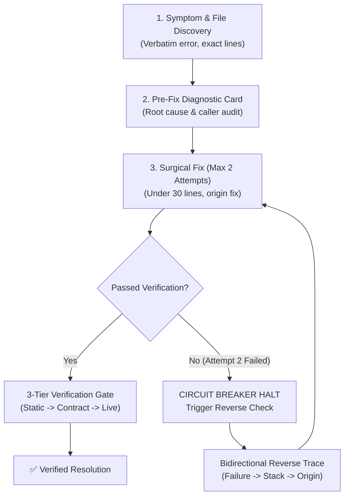

# 🛡️ Zero-Guess Debugger (`zero-guess-debugger`)

[](https://opensource.org/licenses/MIT)
[](http://makeapullrequest.com)
[](#-quick-installation)

> **Stop AI coding assistants from burning your quota with blind trial-and-error.**  
> An open-source protocol and skill for autonomous agents that enforces **Zero-Hallucination**, **Mandatory Pre-Fix Diagnostic Cards**, **2-Attempt Circuit Breakers**, and **Bidirectional Reverse-Checking**.

---

## 💥 The Pain: The AI Quota-Burning Death Loop

Have you ever watched an AI agent try to fix a bug, only to:
1. **Guess** a fix without reading the source code.
2. **Hallucinate** methods or props that don't exist in your dependencies.
3. Edit 5 unrelated files, breaking 3 other working features (**Cascading Regressions**).
4. Blindly re-run failed test commands 8 times in a row, draining your entire daily AI quota.
5. Slap an empty `try { ... } catch (e) {}` or arbitrary `setTimeout` to mask the symptom.

**Zero-Guess Debugger** permanently cures this behavior by injecting strict, disciplined systems engineering protocols into the agent's core decision loop.

---

## ⚡ The 5-Step Zero-Guess Protocol



---

## 💎 The 8 Core Safeguards

### 1. 🔍 Zero-Hallucination Mandate
The agent is forbidden from guessing API signatures, props, or file paths. Every referenced symbol must be grounded in actual source code via file viewing or symbol search before any modification is written.

### 2. 📇 Mandatory Pre-Fix Diagnostic Card
Before touching a single line of code, the agent must output a structured 5-point proof card:
```markdown
### 🔍 Diagnostic Card
- [SYMPTOM]     : Verbatim error message, status code, or observable defect.
- [LOCATION]    : Exact file path, function, and verified line numbers.
- [ROOT CAUSE]  : The exact mechanical failure mechanism.
- [SURGICAL FIX]: Concrete change addressing the origin.
- [BLAST RADIUS]: All callers/consumers audited via grep_search.
```

### 3. 🛡️ Blast Radius & Regression Shield
Before altering any function signature, return type, or shared state, the agent must map all callers across the codebase. No more fixing Bug A only to silently break Features B, C, and D.

### 4. 🛑 The 2-Attempt Circuit Breaker
If an attempted solution hypothesis fails twice, **the agent must HALT immediately**. No 3rd attempts, no endless micro-tweaks, and no trial-and-error spirals. The agent must pause and trigger the Reverse Check.

### 5. 🔄 Bidirectional Reverse-Check Protocol
When an approach fails twice:
* **Forward Trace:** User event $\rightarrow$ listener $\rightarrow$ handler $\rightarrow$ state/engine $\rightarrow$ failing output.
* **Reverse Check:** Failure symptom $\rightarrow$ call stack backwards $\rightarrow$ parameter origin $\rightarrow$ data generator.
* Compare both traces to pinpoint where caller expectations and callee behavior diverged.

### 6. 🚦 Strict 3-Tier Verification Gate
Never test live on devices or browsers if static checks fail:
* **Gate 1 (Static):** Fast compilation & type check (`tsc --noEmit` / syntax validation).
* **Gate 2 (Contract):** Logic, null checks, and import validity.
* **Gate 3 (Live Retrying):** Interactive browser / native device verification runs *only* after Gates 1 and 2 pass 100%.

### 7. 📱 Platform Boundary & Hybrid App Awareness
Specialized defensive patterns for Capacitor, React Native, and Web:
* Wrapped `localStorage` to survive Android WebView private mode `SecurityError`.
* Explicit camera stream disposal (`stream.getTracks().forEach(t => t.stop())`) to prevent battery drain and hardware lockups.
* Native fallbacks for browser-only APIs (`window.print`, `window.alert`).

### 8. 🎯 Patch Minimalism (Anti-Sprawl)
Bug fixes must be surgical (typically under 20–30 lines). Symptom-masking hacks (empty `catch` blocks, arbitrary sleep timers, conditional bypasses) are strictly prohibited.

---

## 🚀 Quick Installation

Drop **Zero-Guess Debugger** into any AI coding tool in 10 seconds:

### For Google Antigravity / Gemini CLI
Copy the skill folder into your global skills directory:
```bash
git clone https://github.com/parinkukadia55/zero-guess-debugger.git ~/.gemini/config/skills/zero-guess-debugger
```

### For Cursor IDE
Copy [`rules/.cursorrules`](./rules/.cursorrules) into your project root:
```bash
cp rules/.cursorrules /path/to/your/project/.cursorrules
```

### For Claude Code / Anthropic
Copy [`rules/CLAUDE.md`](./rules/CLAUDE.md) into your project root:
```bash
cp rules/CLAUDE.md /path/to/your/project/CLAUDE.md
```

### For Windsurf IDE
Copy [`rules/.windsurfrules`](./rules/.windsurfrules) into your project root:
```bash
cp rules/.windsurfrules /path/to/your/project/.windsurfrules
```

### Universal Agent Standard (`AGENTS.md`)
Copy [`rules/AGENTS.md`](./rules/AGENTS.md) into your repository root:
```bash
cp rules/AGENTS.md /path/to/your/project/AGENTS.md
```

---

## 📊 Real-World Benchmark: Guessing vs. Zero-Guess

| Metric | Without Zero-Guess (Trial-and-Error) | With Zero-Guess Debugger |
| :--- | :--- | :--- |
| **Turns to Fix Bug** | 8 – 15 turns | **1 – 2 turns** |
| **Token / Quota Usage** | ~180,000 tokens | **~14,000 tokens (92% savings)** |
| **Files Modified** | 4 – 7 files (high risk of regression) | **1 file (surgical, under 25 lines)** |
| **Cascading Regressions** | Frequent (unnoticed until runtime) | **Zero (guaranteed by Blast Radius check)** |
| **Code Confidence** | Speculative ("Hope this works!") | **Mathematically & Logically Proven** |

---

## 🤝 Contributing

Contributions, feedback, and real-world edge cases are welcome!
1. Fork the repository.
2. Create your feature branch (`git checkout -b feature/awesome-safeguard`).
3. Commit your changes (`git commit -m 'feat: add race condition detection gate'`).
4. Push to the branch (`git push origin feature/awesome-safeguard`).
5. Open a Pull Request.

---

## 📄 License

Distributed under the MIT License. See [`LICENSE`](./LICENSE) for more information.

---

<div align="center">
  <sub>Built with ❤️ by <a href="https://github.com/parinkukadia55">Parin Kukadia</a> to save AI developers time, money, and sanity.</sub>
</div>
