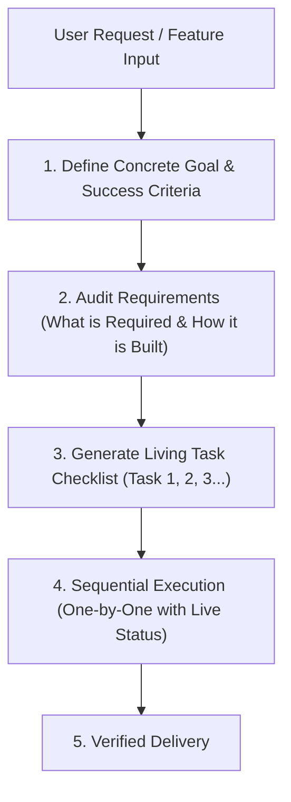

# 🛡️ Zero-Guess Debugger (`zero-guess-debugger`)

[](https://opensource.org/licenses/MIT)
[](https://github.com/parinkukadia55/-zero-guess-debugger)
[](http://makeapullrequest.com)
[](#-quick-installation)

> **Stop AI coding assistants from burning your quota with blind trial-and-error.**  
> An autonomous execution and debugging framework for AI agents. Combines **Goal Decomposition & Living Task Checklists** with strict **Zero-Hallucination**, **Pre-Fix Proof Cards**, **2-Attempt Circuit Breakers**, and **Bidirectional Reverse-Checking**.

---

## 💥 The Pain: The AI Quota-Burning Loop

Have you ever watched an AI agent:
1. Rush to edit files without defining a clear goal or understanding the requirements?
2. Make speculative guesses without reading the source code?
3. Break 3 other working features while attempting to fix one bug?
4. Blindly re-run failed test commands 8 times in a row, draining your entire daily AI quota?
5. Leave you in the dark about what it just did, what is running, and what remains?

**Zero-Guess Debugger** permanently cures this behavior by giving the agent a structured **Planning & Execution Engine** paired with **Zero-Guess Debugging Discipline**.

---

## 🧭 Phase 1: Goal Planning & Task Decomposition

Before writing or altering any code, the agent decomposes the user request into an explicit technical blueprint:



1. **Goal Formulation:** Restate the objective in unambiguous technical terms.
2. **What is Required:** Explicitly map files to create/modify, packages, schemas, and API contracts.
3. **How It Will Be Created:** Concrete architectural strategy, data flow, and function hierarchy.
4. **The Living Task Checklist:** Discrete, atomic milestones tracked sequentially.

---

## ⚡ Phase 2: Sequential Step-by-Step Execution & Live Tracking

The agent executes the plan **one task at a time**, broadcasting real-time progress to the user after each step:

```markdown
### 📋 Execution Progress
- [x] **Task 1: Define TypeScript schemas and contracts** — *Completed (Added `types/astrology.ts`)*
- [x] **Task 2: Implement core computation engine** — *Completed (Verified with unit tests)*
- [>] **Task 3: Build UI view component** — *IN PROGRESS*
- [ ] Task 4: Run 3-Tier Verification Gate — *Pending*
```

No more mysterious agent silences or massive, unchecked code dumps. You always know exactly what has been completed, what is currently running, and what comes next.

---

## 🔒 Phase 3: The Zero-Guess Debugging Protocol

When any bug, exception, or test failure occurs during execution or live testing:

```
                      ┌────────────────────────────────────────┐
                      │ 1. Zero-Hallucination & Identification │
                      │ (Symptom, file location, exact lines)  │
                      └──────────────────┬─────────────────────┘
                                         │
                                         ▼
                      ┌────────────────────────────────────────┐
                      │ 2. Pre-Fix Diagnostic Card             │
                      │ (Proof, root cause & caller audit)     │
                      └──────────────────┬─────────────────────┘
                                         │
                                         ▼
                      ┌────────────────────────────────────────┐
                      │ 3. Surgical Fix (Max 2 Attempts)       │
                      │ (Compact, under 30 lines, root-focused)│
                      └──────────────────┬─────────────────────┘
                                         │
                                         ▼
                      ┌────────────────────────────────────────┐
                      │ 4. If 2 Attempts Fail -> REVERSE CHECK │
                      │ (Bidirectional trace failure -> origin)│
                      └──────────────────┬─────────────────────┘
                                         │
                                         ▼
                      ┌────────────────────────────────────────┐
                      │ 5. Strict 3-Tier Verification Gate     │
                      │ Gate 1: Static (tsc --noEmit)          │
                      │ Gate 2: Contract & Logic Checks        │
                      │ Gate 3: Verified Live Testing          │
                      └────────────────────────────────────────┘
```

### The 8 Core Safeguards

1. **Zero-Hallucination Mandate:** Never assume API signatures, props, or file paths without verifying source code.
2. **Mandatory Pre-Fix Diagnostic Card:**
   ```markdown
   ### 🔍 Diagnostic Card
   - [SYMPTOM]     : Verbatim error message or observable defect.
   - [LOCATION]    : Exact file path, function, and verified line numbers.
   - [ROOT CAUSE]  : Mechanical failure explanation.
   - [SURGICAL FIX]: Concrete change addressing the origin.
   - [BLAST RADIUS]: All callers audited via grep_search.
   ```
3. **Blast Radius & Regression Shield:** Audit all consumers before altering shared functions.
4. **The 2-Attempt Circuit Breaker:** Maximum 2 attempts per solution hypothesis. If Attempt 2 fails, **HALT** and trigger a Reverse Check.
5. **Bidirectional Reverse-Check:** Trace forward from user event to output; trace backwards from error stack to data origin.
6. **Strict 3-Tier Verification Gate:** Gate 1 (Static: `tsc --noEmit`) $\rightarrow$ Gate 2 (Contract check) $\rightarrow$ Gate 3 (Live device/browser testing).
7. **Platform Boundary Awareness:** Storage sandboxing (`localStorage` fallbacks), camera stream teardown (`track.stop()`), and native overrides for Android/Capacitor.
8. **Patch Minimalism:** Surgical fixes (under 20–30 lines). No symptom-masking with empty catches or arbitrary timeouts.

---

## 🚀 Quick Installation

Drop **Zero-Guess Debugger** into any AI coding tool in 10 seconds:

### For Google Antigravity / Gemini CLI
```bash
git clone https://github.com/parinkukadia55/-zero-guess-debugger.git ~/.gemini/config/skills/zero-guess-debugger
```

### For Cursor IDE
Copy [`rules/.cursorrules`](./rules/.cursorrules) into your project root:
```bash
cp rules/.cursorrules /path/to/your/project/.cursorrules
```

### For Claude Code / Anthropic
Copy [`rules/CLAUDE.md`](./rules/CLAUDE.md) into your project root:
```bash
cp rules/CLAUDE.md /path/to/your/project/CLAUDE.md
```

### For Windsurf IDE
Copy [`rules/.windsurfrules`](./rules/.windsurfrules) into your project root:
```bash
cp rules/.windsurfrules /path/to/your/project/.windsurfrules
```

### Universal Agent Standard (`AGENTS.md`)
Copy [`rules/AGENTS.md`](./rules/AGENTS.md) into your repository root:
```bash
cp rules/AGENTS.md /path/to/your/project/AGENTS.md
```

---

## 📊 Real-World Benchmark: Guessing vs. Zero-Guess

| Metric | Without Zero-Guess (Trial-and-Error) | With Zero-Guess Debugger |
| :--- | :--- | :--- |
| **Turns to Deliver Task** | 8 – 15 turns | **1 – 3 structured turns** |
| **Token / Quota Usage** | ~180,000 tokens | **~14,000 tokens (92% savings)** |
| **Files Modified** | 4 – 7 files (high risk of regression) | **1 – 2 files (surgical precision)** |
| **Visibility / Transparency** | Unknown (agent works in secret) | **Live Task Checklist updated per step** |
| **Cascading Regressions** | Frequent (unnoticed until runtime) | **Zero (guaranteed by Blast Radius check)** |

---

## 🤝 Contributing

Contributions, feedback, and real-world edge cases are welcome!
1. Fork the repository.
2. Create your feature branch (`git checkout -b feature/awesome-safeguard`).
3. Commit your changes (`git commit -m 'feat: add race condition detection gate'`).
4. Push to the branch (`git push origin feature/awesome-safeguard`).
5. Open a Pull Request.

---

## 📄 License

Distributed under the MIT License. See [`LICENSE`](./LICENSE) for more information.

---

<div align="center">
  <sub>Built with ❤️ by <a href="https://github.com/parinkukadia55">Parin Kukadia</a> to save AI developers time, money, and sanity.</sub>
</div>
